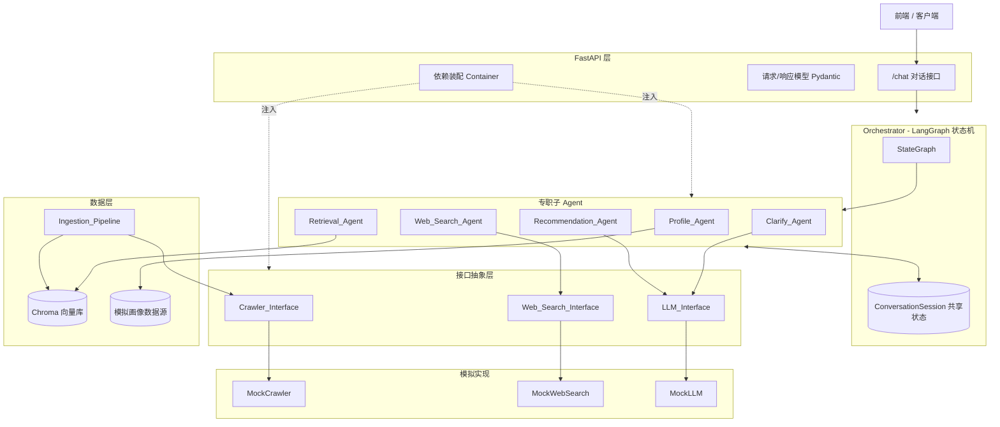
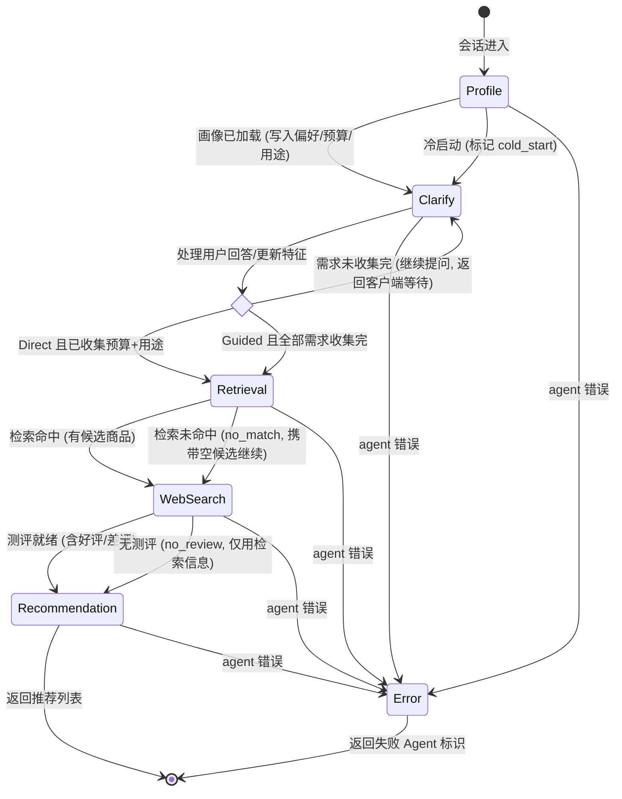
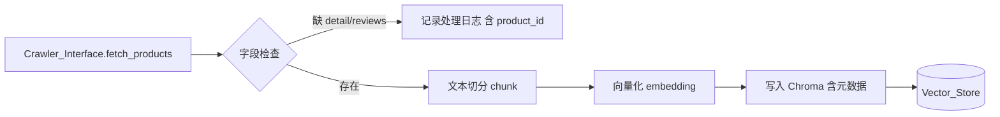

# Design Document

## Overview

本设计在现有 FastAPI 项目上扩展一个基于 RAG 与多 Agent 编排的智能购物助手。系统核心是一个 **Orchestrator（LangGraph 状态机）**，它协调 5 个专职子 Agent（Profile / Clarify / Retrieval / Web_Search / Recommendation），通过一个共享状态对象 `ConversationSession` 在节点间传递上下文与中间结果。所有外部依赖（爬虫、联网搜索、LLM）都通过**接口抽象层**访问，并默认装配**模拟实现**，保证可插拔、可替换、可离线运行。检索基础来自本地 **Chroma 向量库**，由 **Ingestion_Pipeline** 预先灌入约 50 种亚马逊商品的详情与评论。

设计目标：

- 多 Agent 编排是本设计的重点，围绕 LangGraph `StateGraph` 的节点、边、条件路由与共享状态展开。
- 外部依赖零硬编码：全部经接口抽象 + 依赖注入装配。
- RAG 检索、联网测评、推荐生成三条信息流在 `ConversationSession` 中汇聚，产出带理由/链接/好评差评总结的推荐列表。

技术栈：Python 3.11+、FastAPI、LangGraph、Chroma、Pydantic。代码示例使用 Python。

## Architecture

### 分层架构



### 请求生命周期

1. 客户端 `POST /chat`，携带 `session_id`、`message`、可选 `recommendation_count`。
2. FastAPI 层校验请求（缺字段 → 错误响应，Req 9.4），加载/创建对应的 `ConversationSession`。
3. Orchestrator 依据当前 `stage` 从相应节点恢复执行 LangGraph。
4. 各 Agent 读写共享状态；条件边决定流转（冷启动/画像、Direct/Guided、命中/未命中、错误终止）。
5. 到达推荐阶段则产出 `Product_Recommendation` 列表；否则返回下一轮澄清问题。
6. 会话状态持久化于内存会话仓（本阶段），响应返回给客户端。

## Multi-Agent Orchestration（核心设计）

### 状态机流转图



> 说明：`Clarify` 是**可暂停节点**。当仍需向用户提问时，图执行在 Clarify 处产出问题并让出（interrupt），等待下一次 `/chat` 请求携带用户回答后从 Clarify 恢复。检索未命中与无测评均**不终止流程**，而是携带状态标识继续，交由 Recommendation 决定输出（不足时附 `insufficient` 标识，Req 7.6）。仅 Agent 显式返回错误状态时才走 `Error` 终止（Req 8.4）。

### LangGraph 节点与边设计

节点（node）= 一个 Agent 的 `run(session) -> session` 调用；边（edge）= 依据 `session` 字段的条件路由函数。

```python
from langgraph.graph import StateGraph, END
from typing import Literal

def build_orchestrator(agents: "AgentBundle"):
    graph = StateGraph(ConversationSession)

    # 节点：每个 Agent 是一个可调用，签名 (state) -> partial_state_update
    graph.add_node("profile", agents.profile.run)
    graph.add_node("clarify", agents.clarify.run)
    graph.add_node("retrieval", agents.retrieval.run)
    graph.add_node("web_search", agents.web_search.run)
    graph.add_node("recommendation", agents.recommendation.run)

    graph.set_entry_point("profile")

    # profile 完成后固定进入 clarify（内部已区分 cold_start / 画像）
    graph.add_conditional_edges("profile", route_after_profile, {
        "clarify": "clarify",
        "error": END,
    })

    # clarify：需求未收集完 -> 暂停等待用户；收集完 -> retrieval
    graph.add_conditional_edges("clarify", route_after_clarify, {
        "await_user": END,      # 让出，产出问题，等待下一次请求
        "retrieval": "retrieval",
        "error": END,
    })

    graph.add_conditional_edges("retrieval", route_after_retrieval, {
        "web_search": "web_search",   # 命中与未命中都继续
        "error": END,
    })

    graph.add_conditional_edges("web_search", route_after_web_search, {
        "recommendation": "recommendation",  # 有无测评都继续
        "error": END,
    })

    graph.add_conditional_edges("recommendation", route_after_recommendation, {
        "done": END,
        "error": END,
    })

    return graph.compile()
```

条件路由函数（体现所有条件边）：

```python
def route_after_profile(s: "ConversationSession") -> Literal["clarify", "error"]:
    return "error" if s.error else "clarify"

def route_after_clarify(s: "ConversationSession") -> Literal["await_user", "retrieval", "error"]:
    if s.error:
        return "error"
    # Direct: 收集到预算+用途即可推进；Guided: 需求全部收集完
    if s.needs_complete():
        return "retrieval"
    return "await_user"   # 仍有待澄清项，产出 pending_question 并让出

def route_after_retrieval(s) -> Literal["web_search", "error"]:
    return "error" if s.error else "web_search"   # no_match 也继续

def route_after_web_search(s) -> Literal["recommendation", "error"]:
    return "error" if s.error else "recommendation"  # no_review 也继续

def route_after_recommendation(s) -> Literal["done", "error"]:
    return "error" if s.error else "done"
```

`needs_complete()` 封装 Direct/Guided 差异（Req 4.4 / 4.5）：

```python
def needs_complete(self) -> bool:
    collected = self.collected_needs
    if self.pace == "direct":
        return collected.budget is not None and collected.purpose is not None
    # guided：预算、用途、偏好三项都需就绪
    return (collected.budget is not None
            and collected.purpose is not None
            and collected.preferences is not None)
```

### 共享状态对象 ConversationSession（state schema）

`ConversationSession` 是在所有 Agent 间传递的唯一状态载体（Req 8.2）。LangGraph 以其为图状态类型；每个 Agent 只**追加/更新**自己负责的字段，从而实现状态的单调累积。

```python
from pydantic import BaseModel, Field
from typing import Literal, Optional
from datetime import datetime

class CollectedNeeds(BaseModel):
    budget: Optional[float] = None
    purpose: Optional[str] = None
    preferences: Optional[list[str]] = None
    confirmed_features: dict[str, bool] = Field(default_factory=dict)  # yes/no 确认结果

class RetrievedRecord(BaseModel):
    product_id: str
    source_url: str
    matched_text: str          # 匹配到的评论/详情文本 (Req 5.2)
    relevance_score: float

class SocialReview(BaseModel):
    platform: Literal["xiaohongshu", "douyin", "bilibili"]
    sentiment: Literal["positive", "negative"]
    content: str

class WebInfo(BaseModel):
    product_id: str
    product_info: str
    social_reviews: list[SocialReview] = Field(default_factory=list)

class ConversationSession(BaseModel):
    # 标识
    session_id: str
    user_id: Optional[str] = None

    # 流程控制
    stage: Literal["profile", "clarify", "retrieval",
                   "web_search", "recommendation", "done", "error"] = "profile"
    pace: Literal["direct", "guided"] = "guided"
    cold_start: bool = False               # Req 3.2
    error: Optional["AgentError"] = None   # Req 8.4

    # Profile / 需求
    user_profile: Optional["UserProfile"] = None
    collected_needs: CollectedNeeds = Field(default_factory=CollectedNeeds)

    # 对话
    messages: list["ChatTurn"] = Field(default_factory=list)
    pending_question: Optional[str] = None  # clarify 让出时产出的问题

    # Agent 中间结果
    retrieval_results: list[RetrievedRecord] = Field(default_factory=list)
    retrieval_status: Literal["ok", "no_match"] = "ok"       # Req 5.3
    web_results: list[WebInfo] = Field(default_factory=list)
    web_status: Literal["ok", "no_review"] = "ok"            # Req 6.4

    # 输出
    recommendation_count: Optional[int] = None               # Req 9.5
    recommendations: list["ProductRecommendation"] = Field(default_factory=list)
    recommendation_status: Literal["ok", "insufficient"] = "ok"  # Req 7.6

    updated_at: datetime = Field(default_factory=datetime.utcnow)

class AgentError(BaseModel):
    agent: str        # 失败 Agent 标识 (Req 8.4)
    message: str
```

### 5 个 Agent 的输入/输出契约与职责边界

所有 Agent 实现同一协议，只读取自己关心的字段、只写自己负责的字段：

```python
from typing import Protocol

class Agent(Protocol):
    name: str
    def run(self, session: ConversationSession) -> ConversationSession: ...
```

| Agent | 职责 | 读取（输入契约） | 写入（输出契约） | 相关需求 |
|-------|------|------------------|------------------|----------|
| **Profile_Agent** | 加载并解析模拟画像 | `user_id` | `user_profile`、`cold_start`、`collected_needs`（偏好/预算/用途预填）、`error` | 3.1–3.4 |
| **Clarify_Agent** | 多轮澄清，收集/确认需求 | `cold_start`、`user_profile`、`collected_needs`、`pace`、最新用户 `messages` | `collected_needs`（含 `confirmed_features`）、`pending_question`、`error` | 4.1–4.6 |
| **Retrieval_Agent** | RAG 检索 Chroma | `collected_needs` | `retrieval_results`（按相关度排序）、`retrieval_status`、`error` | 5.1–5.4 |
| **Web_Search_Agent** | 联网商品信息 + 社媒测评 | `retrieval_results`（候选商品）、`collected_needs` | `web_results`（含好评差评）、`web_status`、`error` | 6.1–6.5 |
| **Recommendation_Agent** | 综合生成推荐 | `retrieval_results`、`web_results`、`recommendation_count` | `recommendations`、`recommendation_status`、`error` | 7.1–7.6 |

职责边界原则：

- Agent 之间**不直接调用彼此**，只通过 `ConversationSession` 交换数据，流转由 Orchestrator 的条件边决定。
- 外部依赖只经接口访问：`Retrieval_Agent` 依赖 Chroma 客户端，`Web_Search_Agent` 依赖 `Web_Search_Interface`，`Clarify_Agent`/`Recommendation_Agent` 依赖 `LLM_Interface`，`Profile_Agent` 依赖模拟画像源。
- 任一 Agent 捕获到不可恢复错误时设置 `session.error = AgentError(agent=self.name, ...)`，Orchestrator 据此终止（Req 8.4）。

Clarify_Agent 的画像/冷启动统一流程（Req 4.6）：同一 `run` 例程，冷启动时对缺失的预算/用途/偏好逐项提问（Req 4.1）；有画像时以确认现有特征为主、跳过已知项，从而减少提问轮次（Req 4.2），用户 yes/no 回答直接更新 `confirmed_features` 与对应字段（Req 4.3）。

## Interface Abstraction Layer（接口抽象层）

三个接口以抽象基类定义契约，各提供一个模拟实现；通过依赖注入容器按配置装配（Req 2.1–2.4）。

```python
from abc import ABC, abstractmethod

# ---- Crawler ----
class CrawledProduct(BaseModel):
    product_id: str
    source_url: str
    detail: Optional[str] = None
    reviews: list[str] = Field(default_factory=list)

class CrawlerInterface(ABC):
    @abstractmethod
    def fetch_products(self) -> list[CrawledProduct]:
        """返回商品评论与详情数据 (Req 1.1)"""

class MockCrawler(CrawlerInterface):
    def __init__(self, dataset_path: str): self._path = dataset_path
    def fetch_products(self) -> list[CrawledProduct]:
        return _load_preset_products(self._path)   # 约 50 种预置商品 (Req 1.5)

# ---- Web Search ----
class WebSearchInterface(ABC):
    @abstractmethod
    def fetch_product_info(self, product_id: str) -> str: ...
    @abstractmethod
    def fetch_social_reviews(self, product_id: str) -> list[SocialReview]:
        """来自小红书/抖音/B站的好评与差评 (Req 6.2, 6.3)"""

class MockWebSearch(WebSearchInterface):
    def __init__(self, dataset_path: str): self._data = _load_preset_web(dataset_path)
    def fetch_product_info(self, product_id): return self._data.info.get(product_id, "")
    def fetch_social_reviews(self, product_id): return self._data.reviews.get(product_id, [])

# ---- LLM ----
class LLMInterface(ABC):
    @abstractmethod
    def generate(self, prompt: str, **kw) -> str: ...

class MockLLM(LLMInterface):
    def generate(self, prompt: str, **kw) -> str:
        return _template_response(prompt)   # 基于模板的确定性输出，便于测试
```

### 依赖注入 / 装配

用一个轻量容器根据配置选择实现（Req 2.3）。调用方只依赖抽象类型，替换实现无需改调用代码（Req 2.4）。

```python
class Settings(BaseModel):
    crawler_impl: Literal["mock"] = "mock"
    web_search_impl: Literal["mock"] = "mock"
    llm_impl: Literal["mock"] = "mock"
    chroma_dir: str = ".chroma"
    products_dataset: str = "data/products.json"
    web_dataset: str = "data/web_reviews.json"

class Container:
    def __init__(self, settings: Settings):
        self.settings = settings

    def crawler(self) -> CrawlerInterface:
        return {"mock": lambda: MockCrawler(self.settings.products_dataset)}[self.settings.crawler_impl]()

    def web_search(self) -> WebSearchInterface:
        return {"mock": lambda: MockWebSearch(self.settings.web_dataset)}[self.settings.web_search_impl]()

    def llm(self) -> LLMInterface:
        return {"mock": lambda: MockLLM()}[self.settings.llm_impl]()
```

FastAPI 通过 `Depends` 从 `Container` 获取实例并注入到 Agent 组装函数中，实现启动时装配。新增真实实现时，只需在容器的映射表里增加一个分支，接口契约与调用方不变。

## Ingestion Pipeline（数据灌库流程）



流程步骤（Req 1.1–1.5）：

1. **爬取**：`crawler.fetch_products()` 读取约 50 种商品（模拟实现返回预置数据）。
2. **字段校验**：对每条商品，`detail` 与每条 `review` 分别处理；缺失字段跳过并记录含 `product_id` 的日志（Req 1.4）。
3. **文本切分**：将 detail 与 review 按固定长度/句界切分为 chunk。
4. **向量化**：通过 embedding 函数（可插拔，模拟实现用确定性哈希 embedding 便于离线测试）生成向量（Req 1.2）。
5. **写入 Chroma**：每个 chunk 作为一条记录写入，metadata 至少含 `product_id`、`source_url`、`original_text`（Req 1.3）。

```python
class IngestionPipeline:
    def __init__(self, crawler: CrawlerInterface, store: "VectorStore",
                 embedder, logger):
        self._crawler, self._store, self._embed, self._log = crawler, store, embedder, logger

    def run(self) -> int:
        written = 0
        for p in self._crawler.fetch_products():
            texts: list[str] = []
            if p.detail:
                texts.append(p.detail)
            else:
                self._log.info("skip detail", product_id=p.product_id)   # Req 1.4
            if p.reviews:
                texts.extend(p.reviews)
            else:
                self._log.info("skip reviews", product_id=p.product_id)  # Req 1.4

            for chunk in self._chunk(texts):
                self._store.add(
                    embedding=self._embed(chunk),
                    metadata={"product_id": p.product_id,
                              "source_url": p.source_url,
                              "original_text": chunk},        # Req 1.3
                )
                written += 1
        return written
```

## RAG Retrieval Design（检索设计）

`Retrieval_Agent` 将收集到的需求组织为查询文本，向量化后在 Chroma 中做相似度检索（Req 5.1）。

```python
class RetrievalAgent:
    name = "retrieval"
    def __init__(self, store: "VectorStore", embedder):
        self._store, self._embed = store, embedder

    def run(self, session: ConversationSession) -> ConversationSession:
        query = self._build_query(session.collected_needs)
        hits = self._store.query(self._embed(query), top_k=20)  # 返回含 metadata + distance
        results = [
            RetrievedRecord(
                product_id=h.metadata["product_id"],
                source_url=h.metadata["source_url"],       # Req 5.2
                matched_text=h.metadata["original_text"],
                relevance_score=1.0 / (1.0 + h.distance),
            ) for h in hits
        ]
        results.sort(key=lambda r: r.relevance_score, reverse=True)  # Req 5.4
        session.retrieval_results = results
        session.retrieval_status = "ok" if results else "no_match"   # Req 5.3
        return session
```

要点：

- 每条结果携带商品标识、来源链接、匹配文本（Req 5.2）。
- 结果按相关度**降序**排序（Req 5.4）。
- 无匹配时返回空列表并置 `retrieval_status = "no_match"`（Req 5.3），流程继续。

## Data Models

### Product_Recommendation（推荐输出模型）

```python
class ReviewSummary(BaseModel):
    positives: list[str] = Field(default_factory=list)   # 好评要点 (Req 7.5)
    negatives: list[str] = Field(default_factory=list)   # 差评要点 (Req 7.5)

class ProductRecommendation(BaseModel):
    product_id: str
    title: str
    reason: str                 # 推荐理由 (Req 7.4)
    product_url: str            # 商品链接 (Req 7.4)
    summary: ReviewSummary      # 基于评论+测评的好评/差评总结 (Req 7.4, 7.5)
```

### UserProfile（模拟画像）

```python
class UserProfile(BaseModel):
    user_id: str
    preferences: list[str]
    budget: Optional[float] = None
    purpose: Optional[str] = None
```

`Recommendation_Agent` 融合 `retrieval_results` 与 `web_results`，为每个候选生成 `reason` 与 `summary`（好评/差评双面），默认输出 3–5 条（Req 7.2）；请求指定数量则按数量输出（Req 7.3）；候选不足目标数量时返回全部并置 `recommendation_status="insufficient"`（Req 7.6）。

## API Design

### 对话接口

`POST /chat`

请求模型：

```python
class ChatRequest(BaseModel):
    session_id: str
    message: str
    recommendation_count: Optional[int] = Field(default=None, ge=1)  # Req 9.5
```

响应模型：

```python
class ChatResponse(BaseModel):
    session_id: str
    stage: str
    assistant_message: Optional[str] = None          # 澄清问题或提示
    recommendations: list[ProductRecommendation] = []  # 推荐完成时返回 (Req 9.3)
    recommendation_status: Optional[str] = None       # ok / insufficient
    notices: list[str] = []                            # no_match / no_review 等提示

class ErrorResponse(BaseModel):
    error: str
    missing_fields: list[str] = []                     # Req 9.4
    failed_agent: Optional[str] = None                 # Req 8.4
```

处理逻辑：

```python
@app.post("/chat", response_model=ChatResponse,
          responses={400: {"model": ErrorResponse}, 500: {"model": ErrorResponse}})
async def chat(req: ChatRequest, container: Container = Depends(get_container)):
    missing = [f for f in ("session_id", "message") if not getattr(req, f, None)]
    if missing:
        raise HTTPException(400, ErrorResponse(error="missing required fields",
                                               missing_fields=missing).model_dump())  # Req 9.4

    session = session_repo.get_or_create(req.session_id)
    session.recommendation_count = req.recommendation_count      # Req 9.5
    session.messages.append(ChatTurn(role="user", content=req.message))

    result = orchestrator.invoke(session)                        # Req 9.2

    if result.error:                                             # Req 8.4
        raise HTTPException(500, ErrorResponse(error=result.error.message,
                                               failed_agent=result.error.agent).model_dump())

    session_repo.save(result)
    return to_chat_response(result)                              # Req 9.3
```

- 缺 `session_id` 或 `message` → 400，`missing_fields` 列出缺失字段名（Req 9.4）。
- 请求按 `session_id` 定位会话并驱动 Orchestrator（Req 9.2）。
- 推荐完成时响应含推荐列表（Req 9.3）；`recommendation_count` 透传给 Recommendation_Agent（Req 9.5）。
- Agent 错误 → 500，`failed_agent` 标识失败 Agent（Req 8.4）。

## Project Structure（在现有 FastAPI 项目上扩展）

```
MAKABAKA/
├── main.py                      # FastAPI 应用入口（挂载 /chat 路由 + 装配 Container）
├── requirements.txt             # 增补 langgraph, chromadb, pydantic
├── data/
│   ├── products.json            # 预置约 50 种商品（MockCrawler 数据源）
│   ├── web_reviews.json         # 预置社媒测评（MockWebSearch 数据源）
│   └── profiles.json            # 模拟用户画像
├── app/
│   ├── api/
│   │   ├── routes.py            # /chat 路由
│   │   └── models.py            # ChatRequest / ChatResponse / ErrorResponse
│   ├── config.py                # Settings
│   ├── container.py             # 依赖注入容器
│   ├── orchestrator/
│   │   ├── graph.py             # build_orchestrator + 路由函数
│   │   └── session.py           # ConversationSession 及子模型
│   ├── agents/
│   │   ├── base.py              # Agent 协议
│   │   ├── profile_agent.py
│   │   ├── clarify_agent.py
│   │   ├── retrieval_agent.py
│   │   ├── web_search_agent.py
│   │   └── recommendation_agent.py
│   ├── interfaces/
│   │   ├── crawler.py           # CrawlerInterface + MockCrawler
│   │   ├── web_search.py        # WebSearchInterface + MockWebSearch
│   │   └── llm.py               # LLMInterface + MockLLM
│   ├── rag/
│   │   ├── vector_store.py      # Chroma 封装
│   │   ├── embedder.py          # 向量化（模拟：确定性 embedding）
│   │   └── ingestion.py         # IngestionPipeline
│   └── repositories/
│       ├── session_repo.py      # 内存会话仓
│       └── profile_source.py    # 模拟画像加载
├── scripts/
│   └── ingest.py                # 运行灌库流程
└── tests/
    ├── test_ingestion.py
    ├── test_agents.py
    ├── test_orchestrator.py
    ├── test_api.py
    └── test_properties.py       # 属性测试
```

## Error Handling

| 场景 | 处理策略 | 需求 |
|------|----------|------|
| 商品缺 detail/reviews 字段 | 跳过该字段，记录含 product_id 的日志，继续其他字段 | 1.4 |
| 检索无匹配 | `retrieval_status="no_match"`，返回空候选，流程继续，`notices` 提示 | 5.3 |
| 无社媒测评 | `web_status="no_review"`，仅用检索信息生成推荐，`notices` 提示 | 6.4 |
| 候选少于目标数量 | 返回全部候选，`recommendation_status="insufficient"` | 7.6 |
| Agent 不可恢复错误 | 置 `session.error`，Orchestrator 终止，返回 500 + `failed_agent` | 8.4 |
| 请求缺必填字段 | 返回 400 + `missing_fields` | 9.4 |

原则：区分**可继续的空结果状态**（no_match / no_review / insufficient，用状态标识 + notices 表达）与**必须终止的错误**（Agent error）。仅后者中断编排。

## Testing Strategy

采用**单元测试 + 属性测试**双轨。属性测试使用 Hypothesis，每个属性至少 100 次迭代，标签格式：`Feature: rag-multi-agent-shopping-assistant, Property {n}: {text}`。

- **单元/示例测试**：接口模拟实现返回预置数据（1.5/2.2/6.5）、装配选择（2.3）、可替换性（2.4）、图结构含 5 节点与预期边（8.1）、节点完成后的路由（8.3）、检索/推荐触发（5.1/7.1）、`/chat` 基本可用与推荐返回（9.1/9.3）、三源查询覆盖（6.2）。
- **边界测试**：缺失字段跳过与日志（1.4）、检索空结果状态（5.3）、无测评状态（6.4）、候选不足状态（7.6）。
- **属性测试**：见下节 Correctness Properties，覆盖元数据完整性、冷启动标记、画像映射、提问缩减、yes/no 更新、Direct 推进、检索结果完整性与排序、测评情感覆盖、推荐数量与字段完整性、状态累积、错误传播、会话路由、缺字段错误、数量透传。

属性测试通过对模拟实现注入随机预置数据、随机生成 `ConversationSession` / 请求来驱动，避免依赖真实外部服务。

## Correctness Properties

*A property is a characteristic or behavior that should hold true across all valid executions of a system-essentially, a formal statement about what the system should do. Properties serve as the bridge between human-readable specifications and machine-verifiable correctness guarantees.*

### Property 1: 灌库记录元数据完整

*For any* 含 detail 或 reviews 的商品记录，Ingestion_Pipeline 写入 Vector_Store 的每条记录都包含与源商品一致的 product_id、source_url，以及等于该 chunk 内容的 original_text。

**Validates: Requirements 1.2, 1.3**

### Property 2: 冷启动标记正确性

*For any* 用户标识，当模拟画像源中不存在其画像时会话被标记为 Cold_Start，存在时不被标记。

**Validates: Requirements 3.2**

### Property 3: 画像字段映射

*For any* 成功加载的 User_Profile，会话的偏好、预算与用途字段等于该画像的对应字段。

**Validates: Requirements 3.4**

### Property 4: 有画像时提问数不增加

*For any* 相同的初始需求集合，加载画像的会话在 Clarify 阶段产生的新提问数量不超过其冷启动版本产生的提问数量。

**Validates: Requirements 4.2**

### Property 5: yes/no 确认更新特征

*For any* 画像特征与 yes/no 回答，Clarify_Agent 处理后会话中该特征的确认状态等于该回答表达的确认/否定。

**Validates: Requirements 4.3**

### Property 6: Direct 节奏推进条件

*For any* Pace_Direct 会话，一旦预算与用途均已收集，Clarify 后的路由推进至检索阶段，与偏好是否收集无关。

**Validates: Requirements 4.4**

### Property 7: 检索结果字段完整

*For any* 向量库内容与查询，Retrieval_Agent 返回的每条结果都包含非空的 product_id、source_url 与匹配文本。

**Validates: Requirements 5.2**

### Property 8: 检索结果按相关度排序

*For any* 检索结果序列，其相关度分值按非递增顺序排列。

**Validates: Requirements 5.4**

### Property 9: 测评好评差评覆盖

*For any* 同时包含好评与差评的候选测评数据，Web_Search_Agent 聚合结果同时包含 positive 与 negative 两类测评内容。

**Validates: Requirements 6.3**

### Property 10: 默认推荐数量区间

*For any* 未指定数量且可用候选不少于 5 的输入，Recommendation_Agent 输出的推荐条数落在 3 至 5 之间。

**Validates: Requirements 7.2**

### Property 11: 指定数量精确输出

*For any* 请求指定的数量 n（n 不超过可用候选数），Recommendation_Agent 输出的推荐条数等于 n。

**Validates: Requirements 7.3**

### Property 12: 推荐条目字段完整

*For any* 生成的 Product_Recommendation，其推荐理由、商品链接与总结均非空。

**Validates: Requirements 7.4**

### Property 13: 总结体现好评与差评

*For any* 源数据同时含好评与差评的推荐条目，其总结同时包含好评方面与差评方面的内容。

**Validates: Requirements 7.5**

### Property 14: 会话状态单调累积

*For any* Agent 执行序列，早期 Agent 写入 ConversationSession 的字段在后续 Agent 执行后依然保留。

**Validates: Requirements 8.2**

### Property 15: 错误传播携带失败 Agent 标识

*For any* 返回错误状态的子 Agent，Orchestrator 终止流程并在错误响应中包含该 Agent 的标识。

**Validates: Requirements 8.4**

### Property 16: 会话路由一致性

*For any* 携带有效 session_id 与消息的请求，Orchestrator 在该 session_id 对应的会话上驱动并返回反映该会话状态的响应。

**Validates: Requirements 9.2**

### Property 17: 缺字段错误命名

*For any* 缺少 session_id 或 message（或两者）的请求，错误响应恰好列出被省略的字段名。

**Validates: Requirements 9.4**

### Property 18: 推荐数量透传

*For any* 请求中指定的推荐数量，传递给 Recommendation_Agent 的数量等于请求中的值。

**Validates: Requirements 9.5**
